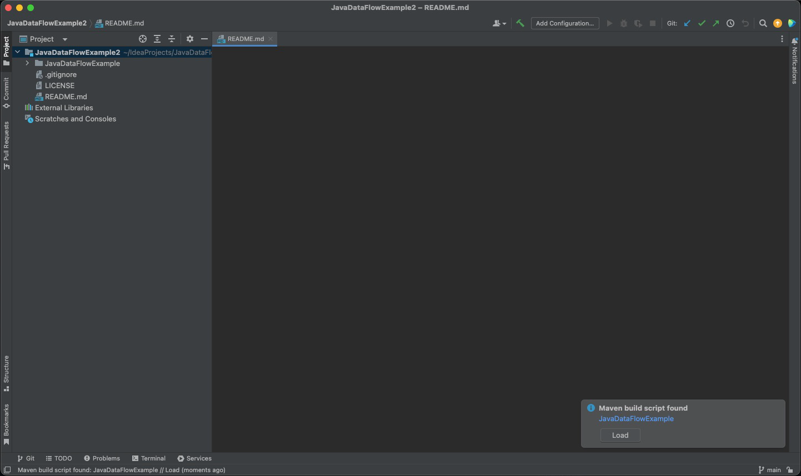

# py2cfg

## Description

py2cfg is a Python package designed to create Control Flow Graphs (CFGs) for Python3 programs, an important concept in software testing and analysis. py2cfg simplifies the generation of these CFGs and offers seamless integration with Graphviz visualization software for easy visualization.

The main objective of py2cfg is to allow software testers and analysts by providing a user-friendly tool to understand, analyze, and assess the control flow of Python programs. By producing clear and intuitive graphical representations, it aids in identifying potential issues, testing scenarios, and debugging processes. Whether the objectives involve assessing code coverage, identifying edge cases, or enhancing software reliability, py2cfg serves as a valuable tool within the software testing toolkit




## Setup

**Step 1: Installation** Install `py2cfg` using `pip`:

```bash
codepip install py2cfg
```

**Step 2: Usage** After installing `py2cfg`, you can use it in several ways:

**Option 1: Run via Shell Command** If you have installed it, you can run `py2cfg` as a shell command to generate control flow graphs for Python files:

```bash
py2cfg <file.py>
```

This command will create a `<file>_cfg.svg` file containing the colored control flow graph of the specified Python file.

**Option 2: Run with pudb3** You can also use `py2cfg` interactively with `pudb3` for debugging:

```bash
py2cfg <file.py> --debug
```

**Option 3: Via Wrapper (Without Installation)** If you prefer not to install `py2cfg`, you can run a script present in the repo, `_runner.py`, to directly generate a control flow graph of a Python program and visualize it:

```bash
cd intoreporootdir
python3 py2cfg/_runner.py path_to_my_code.py
```

**Option 4: Via Import (In  Python Code)** Whether or not you have installed `py2cfg`, you can import the module into your Python code and use the `py2cfg.CFGBuilder` class to build control flow graphs:

```python
from py2cfg import CFGBuilder

cfg = CFGBuilder().build_from_file('example', './example.py')
```


## Demo

will record video soon


python code

````python
# fib.py

def fib():
    a, b = 0, 1
    while True:
        yield a
        a, b = b, a + b

fib_gen = fib()
for _ in range(10):
    next(fib_gen)

```
````

generates this:

<figure><figcaption></figcaption></figure>


python code

````python
# example.py

# Conditional statements (if-elif-else)
x = 10

if x < 0:
    print("x is negative")
elif x == 0:
    print("x is zero")
else:
    print("x is positive")

# For loop
fruits = ["apple", "banana", "cherry"]
for fruit in fruits:
    print("I like", fruit)

# While loop
count = 0
while count < 5:
    print("Count:", count)
    count += 1

# Exception handling (try-except)
try:
    result = 10 / 0  # Division by zero to trigger an exception
except ZeroDivisionError:
    print("Division by zero is not allowed")
else:
    print("Result:", result)

```
````


generates this

<figure><figcaption></figcaption></figure>
