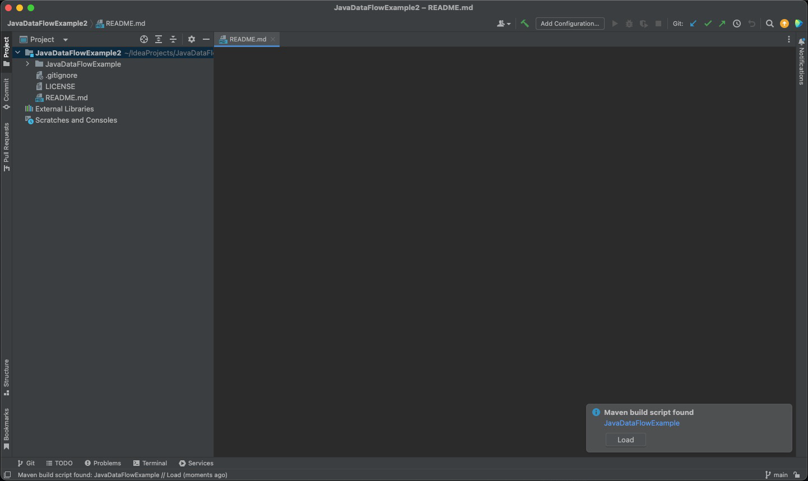

# JavaDataFlow

## Description

JavaDataFlow is a Java library that allows you to create data flow graphs from Java input classes. The generated output is a directed graph where a node represents data (e.g. fields, input parameters, etc.) and the edges represent a node influencing the state of another node. This tool can be used to gather all input nodes to a class that can influence the output of a method.


_JavaDataFlow is available under the terms of the Apache License, and code can be found at the following GitHub repository._



## Setup

**Install IntelliJ IDEA**

* This demonstration uses IntelliJ IDEA integrated development environment. This can be downloaded [here](https://www.jetbrains.com/idea/).

**Clone the Project with Git**

* Clone the repository [JavaDataFlowExample](https://github.com/daanvdh/JavaDataFlowExample) through HTTPS in GitHub.
  * This can be in the command line using the `git clone <repository.git>` command
  * This can also be achieved in IntelliJ IDEA: File > New > Project from Version Control

**Load the Maven Build Configuration**

<figure><figcaption><p>In IntelliJ, click the "Load" button in the bottom right of the screen to finish project configuration.</p></figcaption></figure>

**Update Project Paths**

* In `Main.java`, update the 2 strings `systemPath` and `projectPath` to reflect your machine's proper paths:

```java
String systemPath = "/path/to/JavaDataFlowExample/";
String projectPath = "/path/to/JavaDataFlowExample/src/main/java/";
```

## Demo

In the `JavaDataFlowExample`, the example class is used:

```java
public class Example1 {
  int a;

  public int getA() {
    return a;
  }

  public void setA(int inputA) {
    this.a = inputA;
  }
}
```


The code uses the [JavaParser library ](https://javaparser.org/)to initialize a DataFlowGraph object.&#x20;

```java
DataFlowGraph dfg = JavaDataFlow.create(systemPath + projectPath + inputClass);
```

Upon running the program, text-based output of the DataFlowGraph will be generated in the command line output. This includes the methods, fields, and input/output for the class `Example1.java`.


**Class Structure:**

* The output begins by showing the structure of the class It has a single integer field "`a`" and two methods: "`getA`" and "`setA`."

**Data Flow Relationships - Fields:**

* The "->" arrows indicate the data flow relationships. It explains that data flows from:
  * `a` (the field) to `a` (the field itself).
  * `a` (the field) to `getA_return_line22_col5` and further to `getA_return`.
* The "<-" arrows indicate the reverse data flow, showing that data flows from:
  * `a` (the field) to `setA.a`.
  * `setA.a` to `inputA`.

**Data Flow Relationships - Methods:**

There are two methods, `getA` and `setA`.

* For the `setA` method, it explains the parameters and the data flow relationships:
  * `inputA` is a parameter that flows to `setA.a`.
  * `setA.a` further flows to `a`, and then to `getA_return_line22_col5`, and finally to `getA_return`.
* The changedFields section indicates that within the `setA` method, the `a` field's value is modified, and this change affects `getA_return_line22_col5` and `getA_return`.
* For the `getA` method, it does not have any parameters, and its data flow relationships are detailed:
  * `getA_return_line22_col5` is associated with `a`, and `a` further influences `getA_return`.

**Data Flow Nodes:**

* Within each method, there are several data flow nodes mentioned with their names, represented nodes, input, and output relationships.
* For example, within the "setA" method, it lists the following nodes:
  * "inputA" represents the input parameter "inputA" and has an output relationship with "setA.a."
  * "setA.a" represents the assignment operation "this.a = inputA" and has an input relationship with "inputA" and an output relationship with "a."
* Similar details are provided for the "getA" method.

**Method Returns:**

* The section also indicates the return values of the methods:
  * "setA" method has a return of "null."
  * "getA" method returns "getA\_return."


Below is the output from printing out the DataFlowGraph object:


```
================Printing all fields in the DFG================
DataFlowGraph[name=Example1,representedNode=/**
 * TODO javadoc
 *
 * @author daan.vandenheuvel
 */
public class Example1 {

    int a;

    public int getA() {
        return a;
    }

    public void setA(int inputA) {
        this.a = inputA;
    }
}]fields{
->a	-> a	-> getA_return_line22_col5	-> getA_return

<-a	<- setA.a	<- inputA	<- inputA
}
methods{
method setA{
	parameters{
		inputA	-> inputA	-> setA.a	-> a	-> a	-> getA_return_line22_col5	-> getA_return
	}
	changedFields{
		a	-> a	-> getA_return_line22_col5	-> getA_return
	}
	nodes{
		DataFlowNode[name=inputA,representedNode=inputA,in=[inputA->inputA],out=[inputA->setA.a],type=<null>]
		DataFlowNode[name=inputA,representedNode=int inputA,in=[],out=[inputA->inputA],type=<null>]
		DataFlowNode[name=setA.a,representedNode=this.a = inputA,in=[inputA->setA.a],out=[setA.a->a],type=<null>]
	}
	return null
}method getA{
	parameters{
	}
	changedFields{
	}
	nodes{
		DataFlowNode[name=getA_return,representedNode=public int getA() {
    return a;
},in=[getA_return_line22_col5->getA_return],out=[],type=<null>]
		DataFlowNode[name=a,representedNode=a,in=[a->a],out=[a->getA_return_line22_col5],type=<null>]
		DataFlowNode[name=getA_return_line22_col5,representedNode=return a;,in=[a->getA_return_line22_col5],out=[getA_return_line22_col5->getA_return],type=<null>]
	}
	return getA_return
}
}
```


